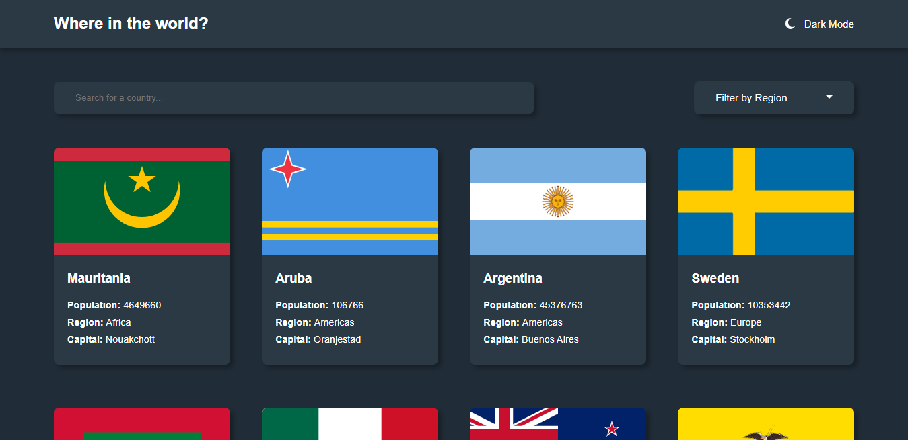
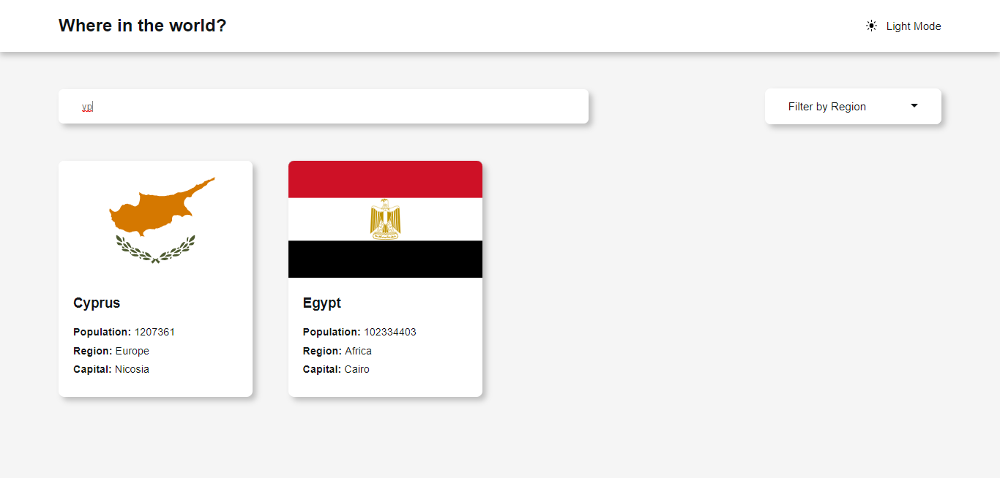
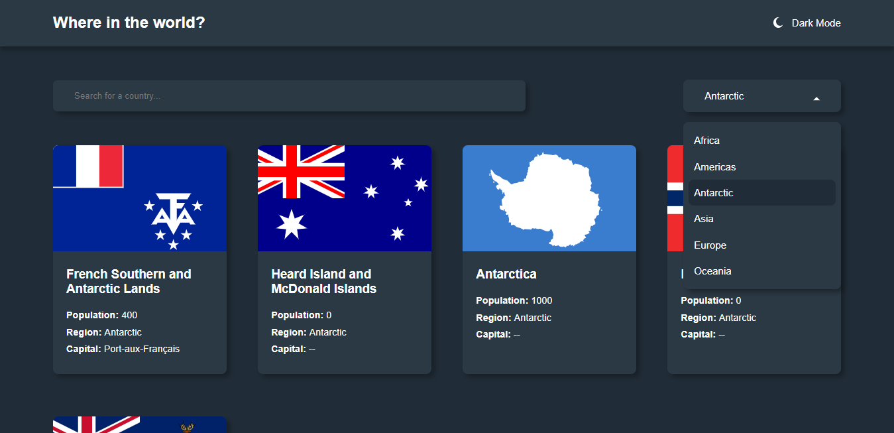
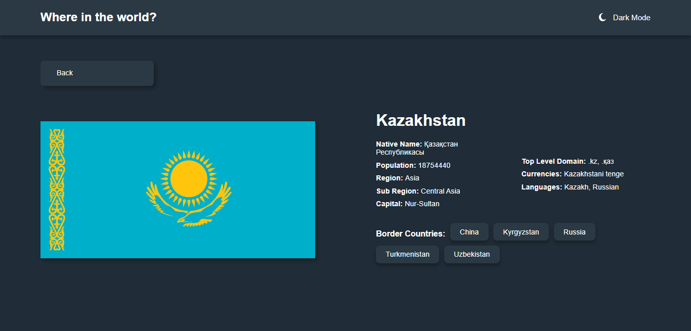
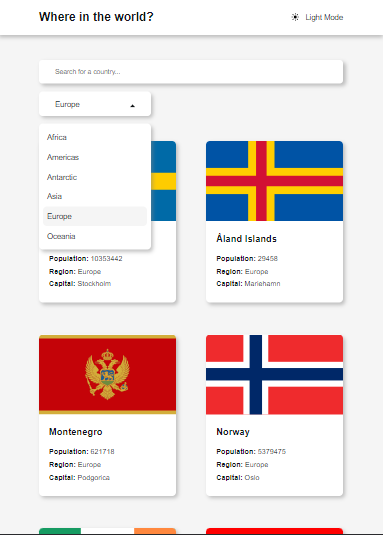
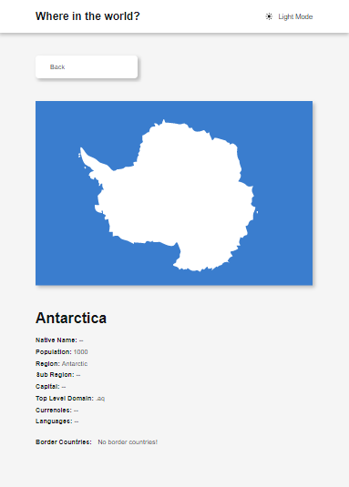
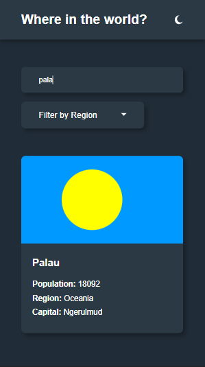
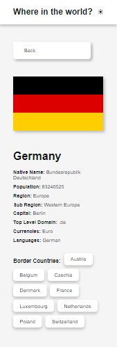

# REST Countries API with color theme switcher

This is a solution to the [REST Countries API with color theme switcher challenge on Frontend Mentor](https://www.frontendmentor.io/challenges/rest-countries-api-with-color-theme-switcher-5cacc469fec04111f7b848ca).

## Table of contents

<!-- - [Overview](#overview) -->
- [The challenge](#the-challenge)  
<!-- - [Links](#links) -->
<!-- - [My process](#my-process) -->
- [Built with](#built-with)
<!-- - [What I learned](#what-i-learned) -->
- [Continued development](#continued-development)
<!-- - [Useful resources](#useful-resources) -->
<!-- - [Author](#author) -->
<!-- - [Acknowledgments](#acknowledgments) -->
- [Screenshot](#screenshot)

<!-- ## Overview -->

### The challenge

Users should be able to:

- See all countries from the API on the homepage
- Search for a country using an `input` field
- Filter countries by region
- Click on a country to see more detailed information on a separate page
- Click through to the border countries on the detail page
- Toggle the color scheme between light and dark mode

### Screenshot

<!-- ### Links -->

<!-- ## My process -->

### Built with

- Semantic HTML5 markup
- CSS custom properties
- Flexbox
- Media Queries
- Vanilla JavaScript ES6+
- AJAX
- Desktop-first workflow

<!-- ### What I learned -->

<!-- ### Continued development -->

<!-- ### Useful resources -->

<!-- ## Author -->

<!-- ## Acknowledgments -->

